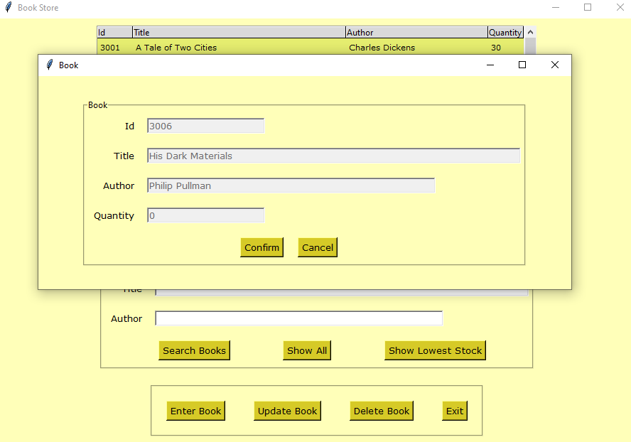
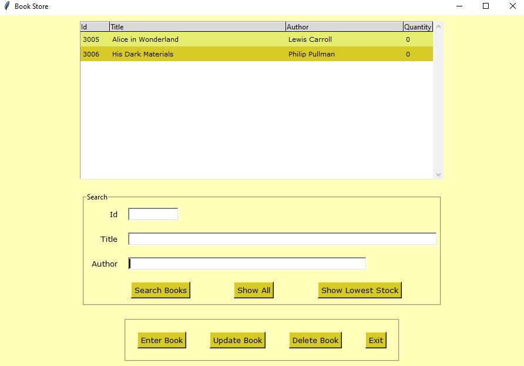

# eBook Store App
This Python application developed using Tkinter and SQLite, provides a GUI for the bookstore clerk to manage the books inventory. They can add, update or delete a book from the database. They can view all books, or books with the lowest stock. They can also search books based on id, title or author.

---
## Contents
| Section | Description |
| :--- | :--- |
| [Requirements](#requirements) | Lists any installations and requirements for the project |
| [Functions](#functions) & [Usage](#usage) | Explanation on how to use the app |

---
### **Requirements**
The application requires data folder to be in the same path as the Python script and execute from the file's directory to be set if using VS code. It does not require the database to be available during execution as the program creates the database, if it does not find one. Copy all the files from this folder and execute bookstore.py. This application does not require any installations.

---
### **Functions**
| Function | Description |
| :--- | :--- |
| [Enter Books](#enter-book) | This lets the user to add books into the book inventory |
| [Update Book](#update-book) | This lets the user to add a book in the book inventory |
| [Delete Book](#delete-book) | This lets the user to delete a book from the book inventory |
| [Search](#search) | This lets the user to search for books from the book inventory |
| [Show All](#show-all) | This displays all the books from the book inventory |
| [Show Lowest](#show-lowest) | This displays the books with the lowest stocks from the book inventory |

---
### **Usage**
### Start Screen

The program loads with the start screen (preloaded with few books) with the above options.

---
### Enter Book

The user can enter fields for the book and add the book to the book inventory upon clicking the Enter Book button. This creates a record for the book in the database.

---
### Update Book

The user can update a book by selecting an entry from the start screen. The update window comes loaded with the entries. The user can then edit and confirm. This updates the book record in the database.

---
### Delete Book

The user can delete a book by selecting an entry from the start screen. The delete window comes loaded with the entries. The user can then confirm deletion. This deletes the book record in the database. 

---
### Search

The user can search books based on id or title or author or all of these from the database. They can enter all or part for title and author and then click the Search Books which brings up the matching books.

---
### Show All

Pressing the Show All button fetches all the records from the database. It shows all the books from the inventory.

---
### Show Lowest

Pressing the Show Lowest button fetches records with lowest stock from the database. It shows all the books with the lowest stock.

---

*Created and Maintained by Dhivya-git*

*Any queries contact: dhivya.subramanian@hotmail.com*

---