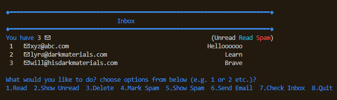
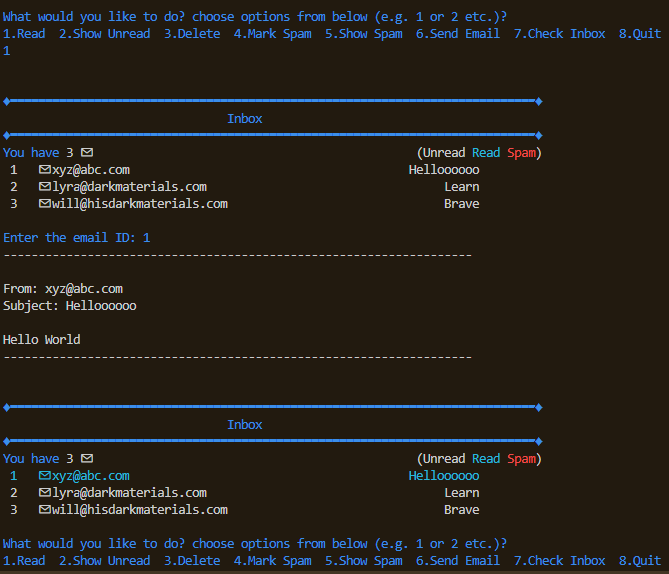
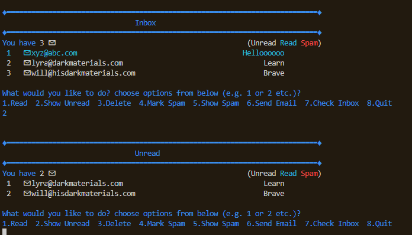
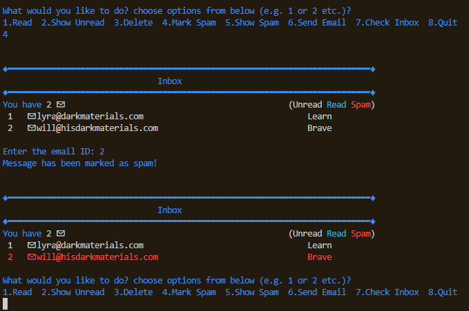
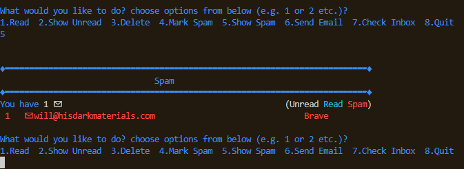
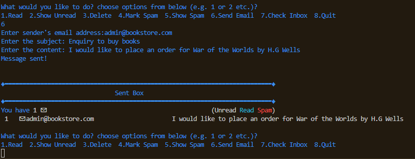
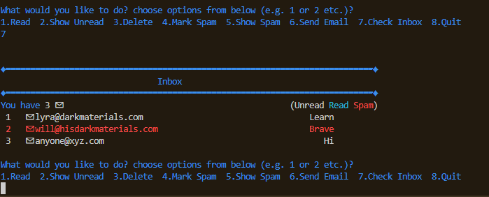

# Email Simulation
Using OOP, this script in Python simulates the email client (inbox preloaded with few emails) by giving the user the option to compose email and send it to a sent box, to get the list of unread mails and read them, to mark the email as spam or delete them, to check for new emails which works by populating the inbox with a random fake email each time the user checks for new emails.

---
## Contents
| Section | Description |
| :--- | :--- |
| [Requirements](#requirements) | Lists any installations and requirements for the project |
| [Functions](#functions) & [Usage](#usage) | Explanation on how to use the app |

---
### **Requirements**
Copy email.py from this folder and execute it. This script does not require any installations.

---
### **Functions**
| Function | Description |
| :--- | :--- |
| [Read](#read) | This lets the user to read an email from the inbox |
| [Show Unread](#show-unread) | This shows unread emails |
| [Delete](#delete) | This lets the user to delete an email from the inbox |
| [Mark Spam](#mark-spam) | This lets the user to mark an email as spam |
| [Show Spam](#show-spam) | This displays a list of spam emails |
| [Send Email](#send-email) | This lets the user send an email to a sent box |
| [Check Inbox](#check-inbox) | This checks the inbox for new messages |

---
#### **Usage**
### Start Screen

This Script loads the above screen at the start. The inbox is loaded intially with three emails. The emails in the inbox are colour coded according to the email category - read, unread, spam.

---
### Read

This option lets the user select an email to read based on email id. It then displays the email content based on the email id. 

---
### Show Unread

This option displays the list of unread emails to the user.

---
### Delete 

This option lets the user select an email to delete based on email id.

---
### Mark Spam 

This option lets the user to select an email to mark as spam based on email id.

---
### Show Spam 

This option gives a list of spam emails to the user.

---
### Send Email 

This option lets the user to compose an email and send it to the sent box

---
### Check Inbox 

This option adds an email randomly to the inbox from a list of emails.

---

*Created and Maintained by Dhivya-git*

*Any queries contact: dhivya.subramanian@hotmail.com*

---