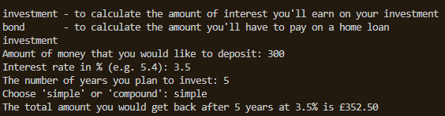
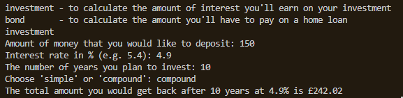
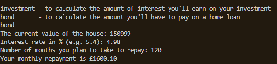

# Finance Calculator
This program in Python lets the user to choose between investment or home loan. For investment, they have the option to choose between simple or compound and input the amount they are investing and the interest rate. The program then gives the user the amount of interest they would earn on their investment for the given period. If the user chooses home loan, it asks them to input the current value of the house, the interest rate and the number of months after which they plan to repay the loan. It then gives them the amount they have to pay each month for the repayment of the mortgage.

---
## Contents
| Section | Description |
| :--- | :--- |
| [Requirements](#requirements) | Lists any installations and requirements for the project |
| [Functions](#functions) & [Usage](#usage) | Explanation on how to use the app |

---
### **Requirements**
Copy the finance_calculators.py from this folder and execute it.  This script does not require any installations.

---
### **Functions**
| Function | Description |
| :--- | :--- |
| [Investment with Simple Interest](#investment-with-simple-interest) | This lets the user to calculate the amount of simple interest a user would earn on their investment for a given period. |
| [Investment with Compound Interest](#investment-with-compound-interest) | This lets the user to calculate the amount of compound interest a user would earn on their investment for a given period. |
| [Bond](#bond) | This lets the user to calculate the amount they have to pay each month for the repayment of the mortgage. |

---
### **Usage**
### Investment with Simple Interest

 
 It calculates the amount of simple interest a user would earn on their investment for a given period. The user has to input the amount they would like to invest, the interest rate, the number of year they plan to invest and choose simple interest.

---
### Investment with Compound Interest

It calculates the amount of compound interest a user would earn on their investment for a given period. The user has to input the amount they would like to invest, the interest rate, the number of year they plan to invest and choose compound interest.

---
### Bond

It calculates the amount they have to pay each month for the repayment of the mortgage after asking the user to input the current value of the house, the interest rate and the number of months after which they plan to repay the loan.

---

*Created and Maintained by Dhivya-git*

*Any queries contact: dhivya.subramanian@hotmail.com*

---