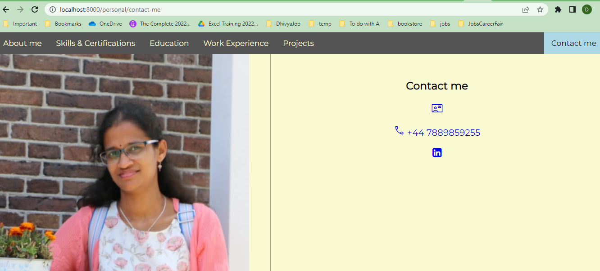

# Personal portfolio & Ecommerce sites using Django
This project includes three webpages as apps, namely, basic portfolio (using HTML),
a dynamic portfolio (using CSS and template extending using Django) & an ecommerce page for grocery (using Bootstrap) into a Django Project

---
## Contents
| Section | Description |
| :--- | :--- |
| [Requirements](#requirements) | Lists any installations and requirements for the project |
| [Functions](#functions) & [Usage](#usage) | Explanation on how to use the app |

---
### **Requirements**
* This project has a dependency, execute pip install requirements.txt from the command prompt.
* Copy all the files from the repository.
* Then, run the following command inside the root folder where the manage.py exists.
    python manage.py runserver

---
### **Functions**
| Function | Description |
| :--- | :--- |
| [Start Index Page](#start-index-page) | This lets the user go to the index page |
| [Personal Portfolio](#personal-portfolio) | This lets the user to access the personal portfolio |
| [E-commerce Page](#e-commerce-page) | This lets the user to access the E-commerce page |
| [Static Portfolio](#static-portfolio) | This lets the user to access the static portfolio |

---
### **Usage**
### Start Index Page

Enter http://localhost:8000 on any browser to load the index.html in the root from which you can navigate to the three apps - Personal Portfolio, E-commerce Page, Static Portfolio.

---
### Personal Portfolio

Enter http://localhost:8000/personal on any browser to load the Personal Portfolio from which you can navigate to all the section with the image on the side.

---
### E-Commerce Page

Enter http://localhost:8000/ecommerce on any browser to load the E-Commerce Page.

---
### Static Portfolio

Enter http://localhost:8000/simplecv on any browser to load the static portfolio Page.

---

*Created and Maintained by Dhivya-git*

*Any queries contact: dhivya.subramanian@hotmail.com*

---