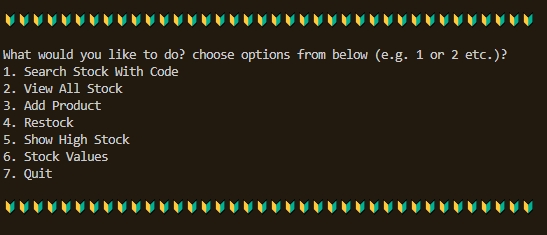
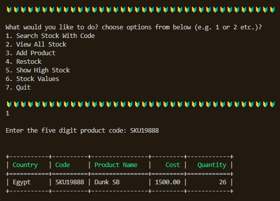
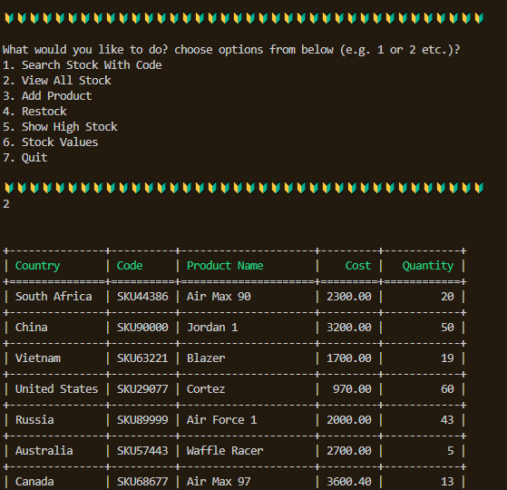
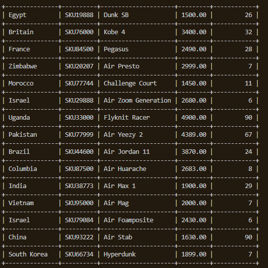
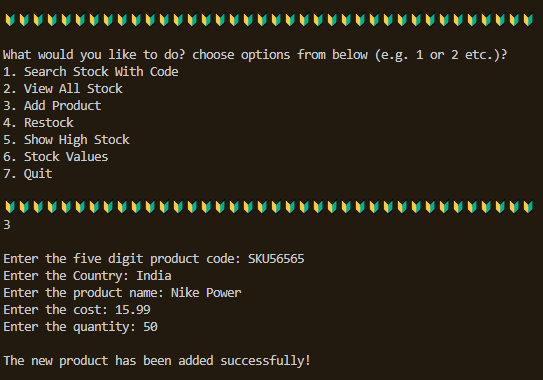
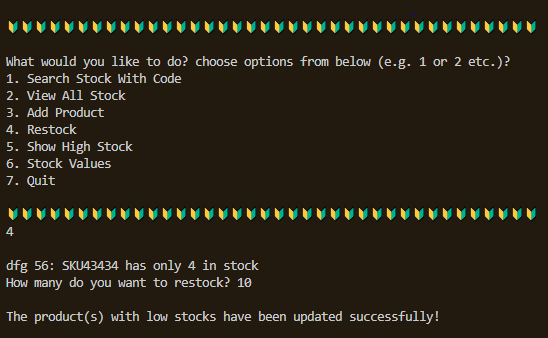
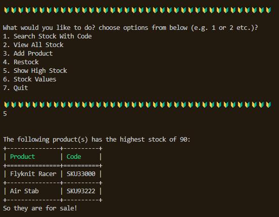
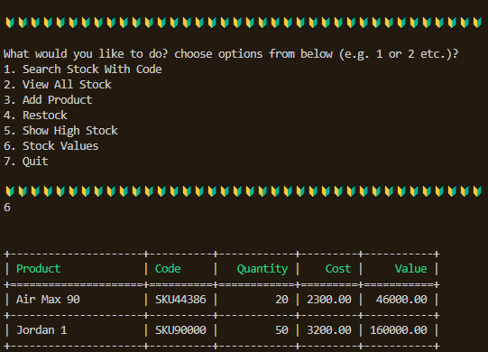
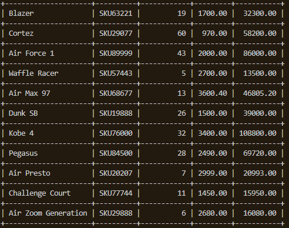
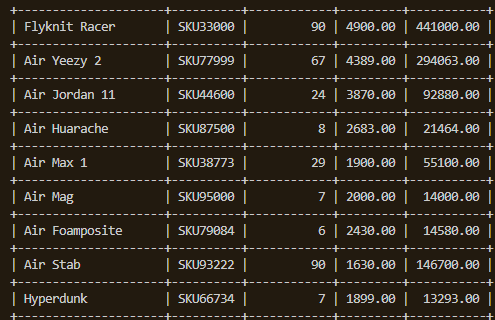

# Stock Management System
This script in Python simulates the Stock Management System for the manager in Nike warehouse using files and Object Oriented Programming (OOP). It lets the manager to add a stock, look at all the stock, search for a product by code, determine the product with the lowest quantity and restock it, determine the product with highest quantity and announce sale on them and calculate the total value of each stock.

---
## Contents
| Section | Description |
| :--- | :--- |
| [Requirements](#requirements) | Lists any installations and requirements for the project |
| [Functions](#functions) & [Usage](#usage) | Explanation on how to use the app |

---
### **Requirements**
The application expects inventory.txt to be in the same folder as the script. The application is dependent on the tabulate module which could be installed by, pip install tabulate. Copy all the files from this folder and execute inventory.py

---
### **Functions**
| Function | Description |
| :--- | :--- |
| [Search Stock With Code](#search-stock-with-code) | This lets the user to search for a shoe from the inventory file based on code |
| [View All Stock](#view-all-stock) | This lets the user to view all the shoes stocks from inventory |
| [Add Product](#add-product) | This lets the user to add a shoe entry into the inventory |
| [Restock](#restock) | This lets the user to update the stock entry for the shoes with the lowest stock in the inventory |
| [Show High Stock](#show-high-stock) | This displays the shoes with hightest stock values from the inventory |
| [Stock Values](#stock-values) | This displays the stock values of all the shoes in the inventory |

---
#### **Usage**
### Start Screen

The program loads with the start screen with the above options.

---
### Search Stock With Code

This option lets the user to search for a shoe based on code from the inventory file.

--- 
### View All Stock

This option lets the user to view all the shoe stocks from the [inventory.txt](inventory.txt) file in a table format.

---
### Add Product

This option lets user to enter five digit product code, country, product name, cost and quantity to create a shoe entry in inventory.txt.

---
### Restock

This option displays the shoes with lowest entries and asks the user to top up the stock values for those shoe entries. It updates the entries for those shoes in inventory.txt

---
### Show High Stock

This option gets the shoes with highest stock values from inventory.txt, displays them and announces sale on them.

---
### Stock Values

This option calculates the stock value for each stock from the inventory.txt and displays the value along with product, code, quantity and cost.

---

*Created and Maintained by Dhivya-git*

*Any queries contact: dhivya.subramanian@hotmail.com*

---