# Task Management System
It is a system using files in Python for a small business, which lets the users to login to the system and manage tasks assigned to each member of the team. The users registered in the system can add tasks for themselves and for others. They can view all the tasks or just the tasks assigned to them. They can mark the tasks assigned to them to completion or edit the due date of their task. It lets only the admin user to register new users and display the tasks statistics and user statistics.

---
## Contents
| Section | Description |
| :--- | :--- |
| [Requirements](#requirements) | Lists any installations and requirements for the project |
| [Functions](#functions) & [Usage](#usage) | Explanation on how to use the app |

---
### **Requirements**
The task_manager.py expects tasks.txt and user.txt to be in the same folder as the script. Copy all the files from this folder and execute the task_manager.py. This script does not require any installations.

---
### **Functions**
| Function | Description |
| :--- | :--- |
| [r - register user](#r---register-user) | This lets only the admin user to create new user|
| [a - add task](#a---add-task) | This lets any user to add a task for themselves or for others |
| [va - view all tasks](#va---view-all-tasks) | This lets any user to view all tasks |
| [vm - view my tasks](#vm---view-my-tasks) | This lets any user to view and edit just their tasks |
| [gr - generate reports](#gr---generate-reports) | This option is only for admin user to generate task and user reports in text files|
| [ds - display statistics](#ds---display-statistics) | This option is only for admin user to display the task and user statistics on to the screen |

---
#### **Usage**
### Start Screen
The program has two start screens based on the users logged in.

---
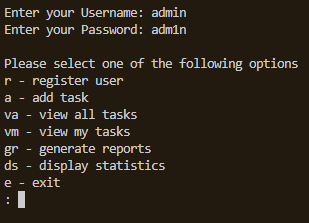

The admin user have the additional options of registering users, generating reports and displaying the statistics from those reports in addition to adding tasks, viewing the tasks of all users and viewing their own and editing them.

---
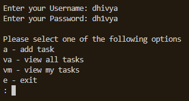

The other users have the options to add tasks, to view the tasks of all users and to view their own and to edit them.

---
### r - register user
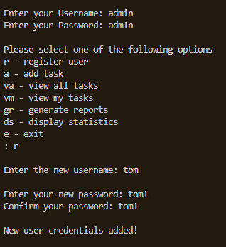

This option lets the admin user to register new users by providing a username for the new user and a password, then reconfirming it. It creates an entry for the user in [user.txt](user.txt)

---
### a - add task
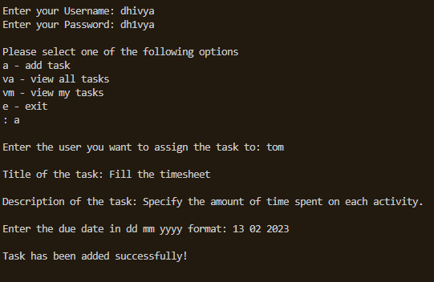

This option lets any users to add a task for themselves or others. They have to provide username to whom they would like to assign the task, the title of the task, the description of the task and the date the task is due for completion. It creates an entry for the task in [tasks.txt](tasks.txt)

---
### va - view all tasks
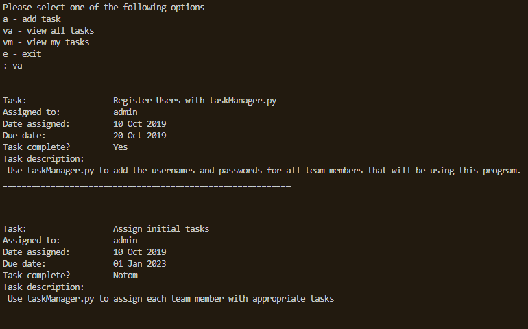
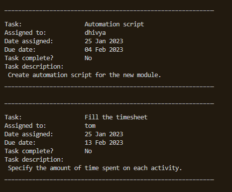

This option lets any user to view the tasks assigned to all users.

---
### vm - view my tasks
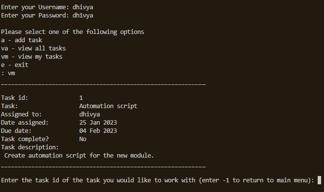

This option lets any user to view the tasks assigned to them and it further asks for the task id of the task that they wish to work with.

---

Upon entering the task id, they are provided with two options - if they would like to mark the task to completion or edit the task.

| Command | Sub Commands | 
| :--- | :--- |
| vm - view my tasks | [m - mark the task as complete](#m---mark-the-task-as-complete) or [ed - edit the task](#ed---edit-the-task) | 
| ed - edit the task | [u - username  of the person to whom the task is assigned](#u---username-of-the-person-to-whom-the-task-is-assigned) or [d - due date of the task can be edited](#d---due-date-of-the-task-can-be-edited) |

---
### m - mark the task as complete
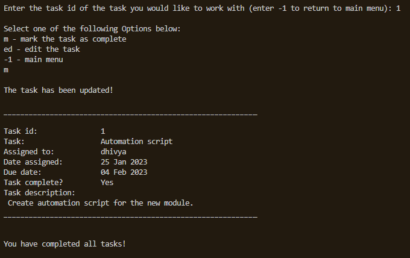

This option lets them to mark the chosen task to completion. It updates the task entry in [tasks.txt](tasks.txt)

---
### ed - edit the task
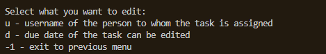

This option further asks the user if they would like to edit the username of the person to whom the task is assigned or edit the due date of the task.

---
### u - username  of the person to whom the task is assigned
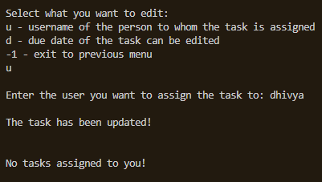

This option lets the user to change the task assigned to them to be assigned to someone else. It updates the task entry in [tasks.txt](tasks.txt)

---
### d - due date of the task can be edited
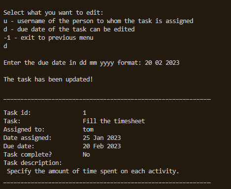

This option lets the user to change the due date of the task assigned to them to a future date. It updates the task entry in [tasks.txt](tasks.txt)

---
### gr - generate reports
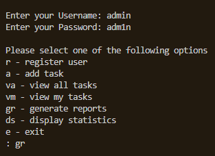

This option generates a report on tasks statistics in [task_overview.txt](task_overview.txt) and a report on statistics on tasks assigned to users in [user_overview.txt](user_overview.txt)

---
### ds - display statistics
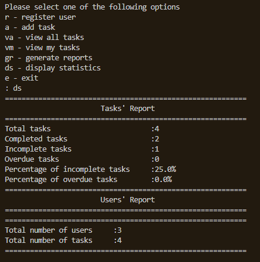
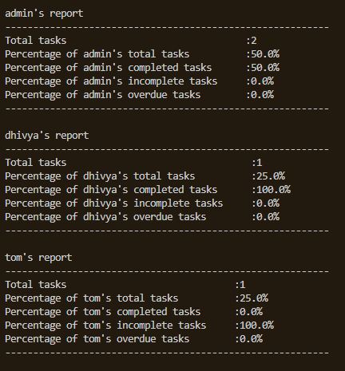

Selecting this option on its own will generate reports in the [task_overview.txt](task_overview.txt) and [user_overview.txt](user_overview.txt), like the generate reports option and also display the contents of these files on to the screen.

---

*Created and Maintained by Dhivya-git*

*Any queries contact: dhivya.subramanian@hotmail.com*

---